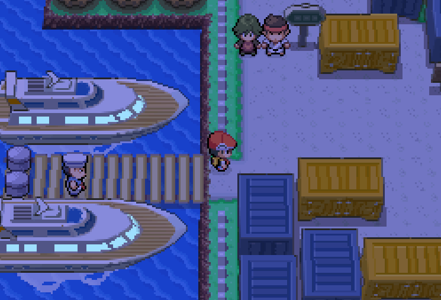

# Pokemon
Save states for Pokemon games to be managed as code.



## Setup

### Delta on Mobile
1. Install Delta, transfer any GBA or NDS ROMs you own.
    - DISCLAIMER: Don't share your ROM files with others who don't own the games. Use a private repo or .gitignore ROM files if they will share your repo's folder structure.
2. Install `Working Copy` or a different mobile git client of your choice. Note that Working Copy requires a premium license for pushing to repos, which we will do in this workflow. They offer a perpetual license for the current version which should work.
3. Clone the repo and configure authentication using OAuth or a PAT.

### RetroArch on Windows
1. Install [RetroArch](https://www.retroarch.com/?page=platforms).
  - Note for Windows: Don't install in `C:\Program Files` directory to avoid permission issues.
  - Note for Mac: Don't install from the App Store, use the direct installer above.
2. In `Main Menu → Online Updater`, update the following (at the bottom of the list):
  - Update Core Info Files
  - Update Assets
  - Update Databases
3. Still in `Online Updater`, click `Core Downloader` and download:
  - Nintendo - Game Boy Advance (mGBA)
  - Nintendo - Nintendo DS (melonDS)
4. Options for linking repo files to RetroArch save states:
These are the options you have for managing `.sav` files, which are used between iOS and desktop OS. **To generate these, you must use the ingame "save" features on desktop OS. IOS emulators like Delta already use only these. Reminder that this is either `Start` or `X` depending on the game you're playing.
  - a. Change RetroArch's save file location: (recommended)
    - Go to `Settings → Directory` and choose `Save Files`. Browse to this repo.
    - Go to `Main Menu → Configuration File → Save Current Configuration` to lock in changes.
  - b. Write directly to ROM location: (untested)
    - DISCLAIMER: Don't share your ROM files with others who don't own the games. Use a private repo or .gitignore ROM files if they will share your repo's folder structure.
    - Go to `Settings → Saving` and toggle on `Write Saves to Content Directory`. This makes RetroArch write .sav files to that location.

### Folder Structure Example
```bash
this-repo/
├── .gitignore
├── GBA/
│   ├── GAME.gba
│   └── GAME.dsv
│   └── GAME.sav
└── NDS/
    ├── GAME.nds
    └── GAME.dsv
│   └── GAME.sav
```

### Enable Auto-Flush Save States (Optional)
By default, save states are persisted to disk **only on graceful exits of the program**. Instead, we can make RetroArch save every few seconds.
This will help us additionally check in the `.state` save state files.
1. Go to `Settings → Saving` and find `SaveRAM Autosave Interval`. Change from `Disabled` to `10 seconds`.
2. Go back to `Main Menu → Configuration File → Save Current Configuration` to save changes.

### Configure Emulator/Games
1. `Load Core` to select your emulator.
2. `Load Content → File Browser → Start Directory` to configure the git repo as the location to search from.
3. `Import Content → Scan Directory` to load items.

## Importing and Exporting Saves

### Import on Mobile (Delta on iPhone)
**NOTE** - Instead of doing all this it may be possible to directly load a .sav file into Delta after pulling the repo. This is untested.
0. Ensure that the checked in file is in a proper DeSmuME format if it came from a RetroArch export. See `Converting Between `.dsv` and `.sav` Save Files`.
1. From within Working Copy, pull the repo.
2. In Delta, hold on the game icon to bring up the context menu. Click `Manage Save File -> Import Save` and choose the save file you want from the repo.
3. Close Delta and restart, so it takes from the updated save file. The next launch should give you the "Continue Saved Game" dialog after pressing Start at the main menu. 

### Export on Mobile (Delta on iPhone)
1. After a game session, save the game **using the ingame Start -> Save** option. We want this `.sav` file instead of the `.state` emulator state, though you may save that too. Desktop `.state` save files are synced in our system, but we can't export or import those from Delta.
2. Go back to the main menu, and hold on the game icon to bring up the menu. Click `Manage Save File -> Export Save`, navigating to our Working Copy git repo location. Working Copy mounts at the root of the Files explorer on iPhone. Confirm the overwrite.
3. From within Working Copy, confirm you see changes in the repo and push.
**IMPORTANT NOTES:** - See below about converting between `.dsv` and `.sav` save files, as they don't plug and play between mobile and desktop.

### Import on Desktop (RetroArch)
0. Ensure that the checked in file is in a proper format (no DeSmuME headers) if it came from a RetroArch export. See `Converting Between `.dsv` and `.sav` Save Files`.
1. Pull the repo.
2. In RetroArch, confirm that `Settings -> Directory -> Start Directory` still shows your repo location from initial setup.
3. Refresh RetroArch content using `Import Content -> Scan Directory -> <Scan This Directory>` on your repo location.
4. The next launch should give you the "Continue Saved Game" dialog after pressing Start at the main menu.
**Notes**:
Blue Screen issues happen when loading save files. Usually due to missing files:
1. Download `bios7.bin`, `bios9.bin`, and `firmware.bin` from [the Archive link](https://archive.org/download/nds-bios-firmware).
2. Open the `system/` folder in your install:
- On Windows, this is in `C:\RetroArch-Win64\system`, or inside `AppData` if installed via Steam.
- Oh Macos, this is in `~/Documents/RetroArch/system` if installed via the official download, or in `~/Library/Application Support/RetroArch` if installed via the app Store (not recommended) - On Mac, this location is a hidden directory so you must open Finder and choose `Go > Go To Folder`.
3. Paste `bios7.bin`, `bios9.bin`, and `firmware.bin` in that folder, not into any emulator subdirectory.
4. Restart RetroArch, start your game, and quickly press `F1` to open the in game menu.
5. Select `Core Options -> System -> and toggle **Use Real BIOS** (or **Boot Game Directly**) to ON.
6. Restart the game from the F1 quick menu.

### Export on Desktop (RetroArch)
1. After a game session, save the game **using the ingame Start -> Save** option. We want this `.sav` file instead of the `.state` emulator state, though you may save that too.
2. Confirm that the git repo shows changes, and push them. You'll probably also want to convert to `.dsv` so you can load on mobile too. See below notes.
**IMPORTANT NOTES:** - See below about converting between `.dsv` and `.sav` save files, as they don't plug and play between mobile and desktop.

### Converting Between `.dsv` and `.sav` Save Files
The `.dsv` and `.sav` file for mobile and desktop, respectively, contain different header content and thus are not readable by the other programs. However we can convert save files to be compatible. (Easiest to do on Desktop)

#### Delta -> RetroArch Conversion
0. Clone `https://github.com/jojojo8359/DeSmuMESaveConverter` into `utilties/` folder (gitignored).
1. Create `in/` in the repo, and copy the `.dsv` in there. Also, create the other required folder `out/`.
2. `python main.py`, fixing any missed imports.

#### RetroArch -> Delta Conversion
0. Clone `https://github.com/jojojo8359/DeSmuMESaveConverter` into `utilties/` folder (gitignored).
1. Create `in/` in the repo, and copy the `.sav` in there. Also, create the other required folder `out/`.
2. `python main.py`, fixing any missed imports.

## Gameplay
Select your emulator at the bottom of the menu, and select the game to play.

### Emulator Keybinds
| Keybind (Windows / Mac) | Functionality |
| :--- | :--- |
| **`Up` / `Down` / `Left` / `Right` Arrows** | Move character / Navigate menus |
| **`X`** | **A Button** (Confirm / Interact) |
| **`Z`** | **B Button** (Cancel / Run) |
| **`Enter`** *(or `Right Shift` on Mac)* | **Start Button** (Open Pokémon menu) |
| **`Right Shift`** *(or `Return` on Mac)* | **Select Button** (Registered Key Item) |
| **`Q` / `W`** | **L / R Triggers** (GBA/DS) |
| **`S` / `A`** | **X / Y Buttons** (DS only) |
| **`F1`** *(or `fn` + `F1` on Mac)* | Open RetroArch Menu Overlay |
| **`Spacebar` (Hold)** | **Fast-Forward** (Speed up battles/grinding) |
| **`P`** | Pause Emulation |
| **`F2`** *(or `fn` + `F2` on Mac)* | **Save State** (Local machine only) |
| **`F4`** *(or `fn` + `F4` on Mac)* | **Load State** (Local machine only) |
| **`Esc` (Press Twice)** | Instantly Close RetroArch |

For manual rebinds, Press `F1` (or `fn + F1` on Mac) to open quick menu, Press Back twice to reach the Main Menu, then go to `Settings → Input → RetroPad Binds → Port 1 Controls` and rebind what you need.
